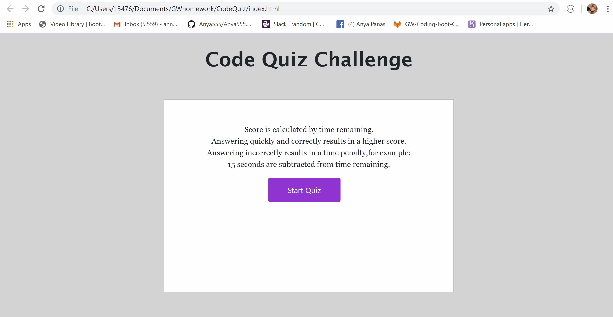

# Code Quiz

 Code Quiz is a timer-based quiz application that stores high scores client-side.

APP FLOW: 

- The user arrives at the landing page and is presented with a call-to-action to "Start Quiz." 

- Clicking the "Start Quiz" button presents the user with a series of questions. The timer is initialized with a value and immediately begins countdown.

- Score is calculated by time remaining. 

- When time runs out and/or all questions are answered, the user is presented with their final score and asked to enter their initials. Their final score and initials are then stored in localStorage.

